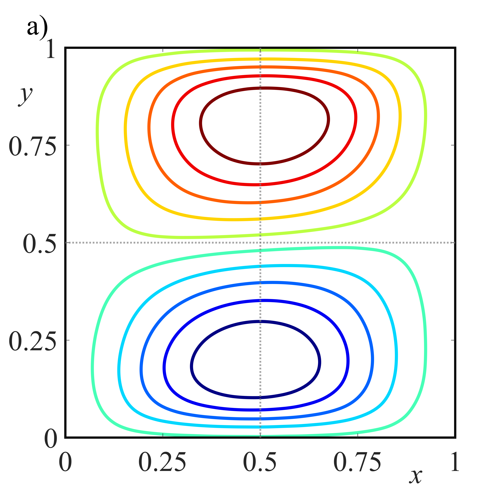

# Figura 12a: Horizontal velocity Ra=10^3

---

### 📊 Visualización

---

### 📂 Archivos Disponibles
| Archivo | Descripción | Formato |
| :--- | :--- | :--- |
| `Ra3Vx.png` | Exportación en alta resolución de la figura. | Imagen PNG |
| `Ra3Vx.fig` | Archivo fuente original (Editable en MATLAB). | MATLAB Figure |

### 🔬 Notas de Reproducibilidad
Para visualizar o editar los datos originales, se recomienda abrir el archivo `.fig` en MATLAB (versión R2020b o superior). La imagen `.png` ha sido generada con una resolución de 300 DPI para asegurar la calidad de impresión.

---
*Repositorio vinculado a la tesis: PhD Figures - Stochastic Thesis*
