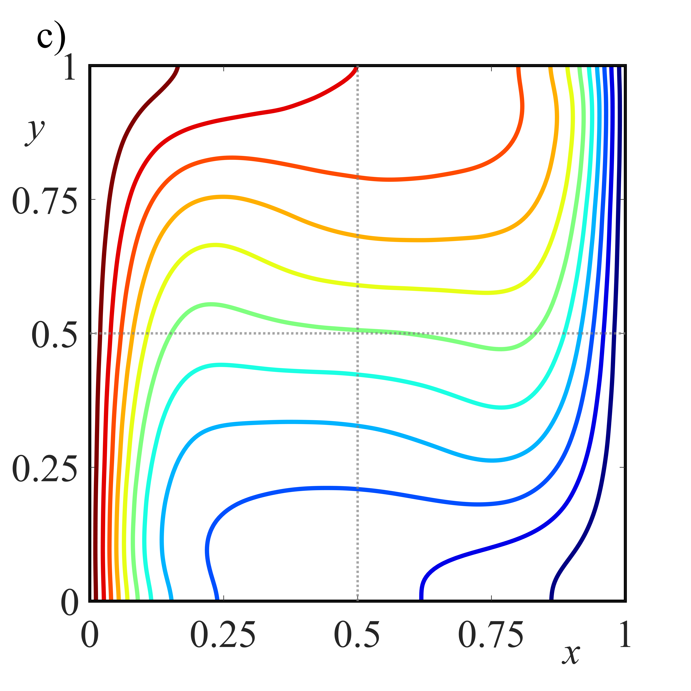

# Figure 14c: Temperature Field Ra=10^4

---

### 📊 Display

---

### 📂 Available files
| File Name| Description| Format |
| :--- | :--- | :--- |
| [TRa5.png](./TRa5.png) | High-resolution image export. | PNG Image |
| [TRa5.fig](./TRa5.fig) | Original source file (Editable in MATLAB). | MATLAB Figure |

### 🔬 Reproducibility Notes
To view or edit the raw data, it is recommended to open the `.fig` file using MATLAB (version R2020b or later). The `.png` image was generated at 300 DPI to ensure high-quality print resolution for the final manuscript.

---
*Repository linked to: PhD Figures - Stochastic Thesis*
