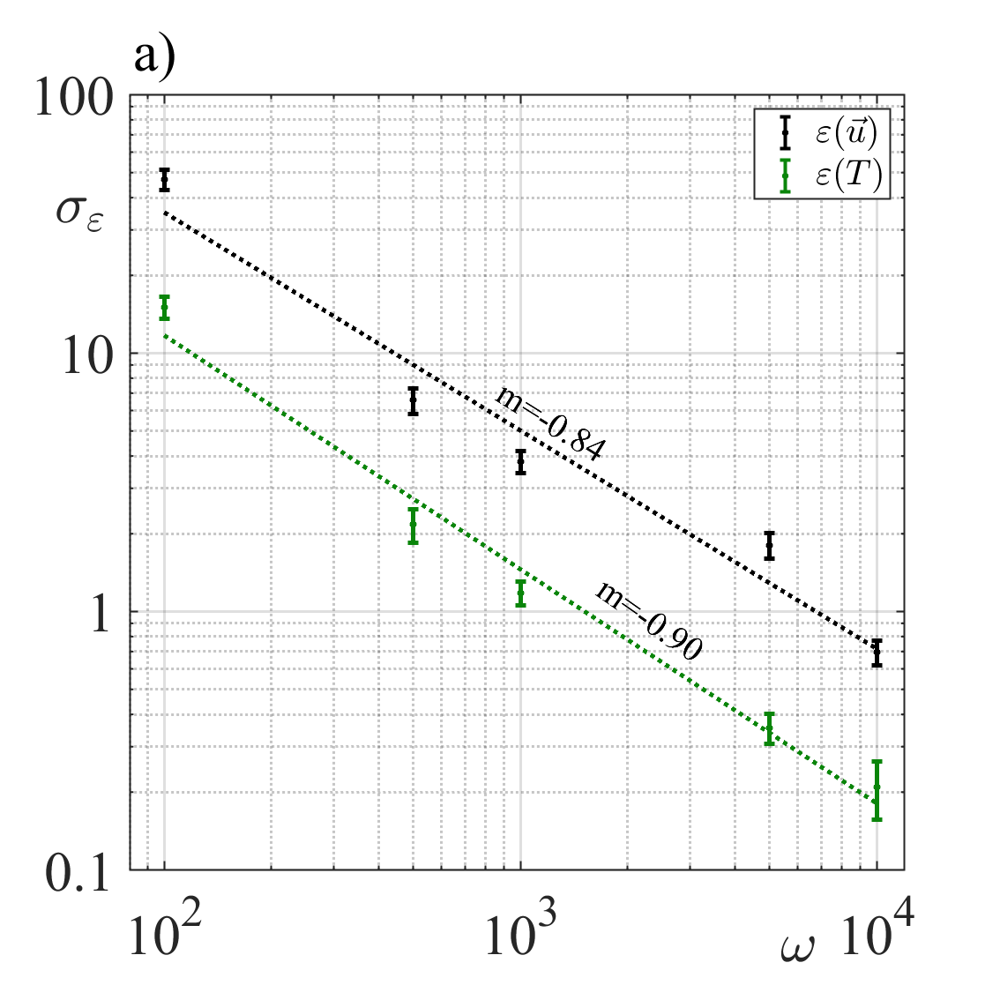
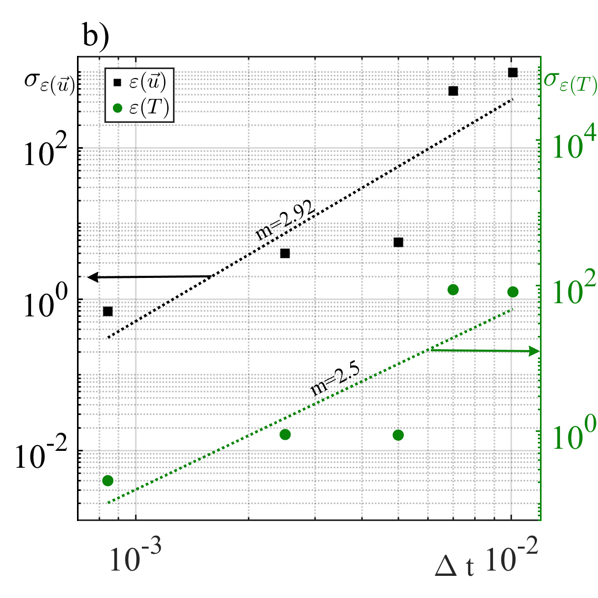

# Figure 17: Comparison of standard deviation of the error

---

### 📊 Display
| Stochastic Walkers | Time-Step Evolution (Dt) |
| :---: | :---: |
|  |  |
| **Random Walk Path Analysis** | **Error Deviation vs. Δt** |
---

### 📂 Available files
| File Name| Description| Format |
| :--- | :--- | :--- |
| `Dt.png` | Comparasion of the standard deviation of the error under varying numbers of random walkers. | PNG Image |
| `caminantes.png` | Comparasion of the standard deviation of the error under varying numbers of time step. | PNG Image |
| `Dt.fig` | Original source file (Editable in MATLAB). | MATLAB Figure |
| `caminantes.fig` | Original source file (Editable in MATLAB). | MATLAB Figure |

### 🔬 Reproducibility Notes
To view or edit the raw data, it is recommended to open the `.fig` file using MATLAB (version R2020b or later). The `.png` image was generated at 300 DPI to ensure high-quality print resolution for the final manuscript.

---
*Repository linked to: PhD Figures - Stochastic Thesis*
