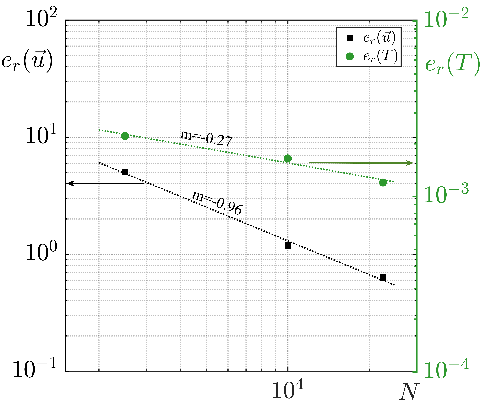

# Figure 20: Mask independence analysis using the global L^2

---

### 📊 Figure Gallery

| Figure 01 | Figure 02 | Figure 03 |
| :---: | :---: | :---: |
| .png)| .png) |  |
| **L^2 norm of velocity as a function of nuber of nodes** | **L^2 norm of the temperature T as a function of N** | **Relative error of L^2 on a logithmic scale velocity** |

---

### 📂 File Repository

| Filename | Description | Format |
| :--- | :--- | :--- |
| [L2(u).png](L2(u).png) / [.fig](L2(u).fig) | L^2 norm of velocity as a function of nuber of nodes. | Image / MATLAB |
| [L2(T).png](L2(T).png) / [.fig](L2(T).fig) | L^2 norm of the temperature T as a function of N. | Image / MATLAB |
| [Figure.png](Figure.png) / [Figure.fig](Figure.fig) | Relative error of L^2 on a logithmic scale velocity| Image / MATLAB |

### 🔬 Technical Details
* **Source Files:** All `.fig` files are compatible with MATLAB R2020b and newer.
* **Resolution:** Images are exported at 300 DPI for high-quality publication standards.

---
*PhD Figures Repository - Stochastic Thesis*
