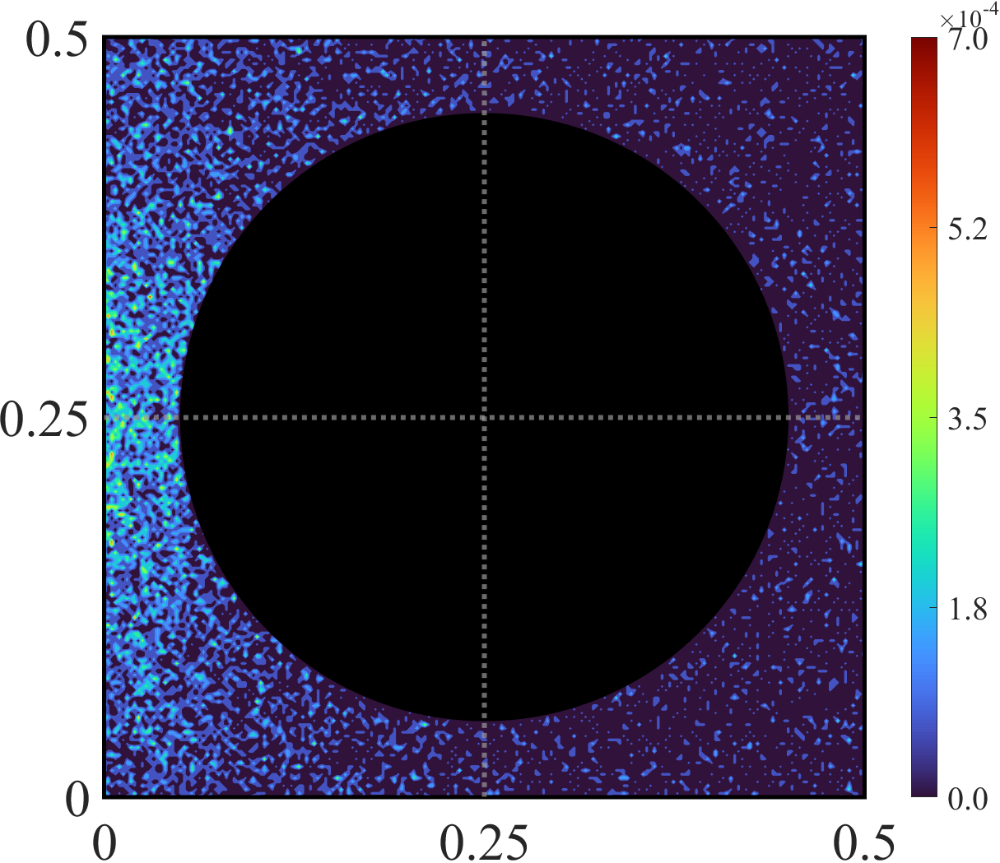
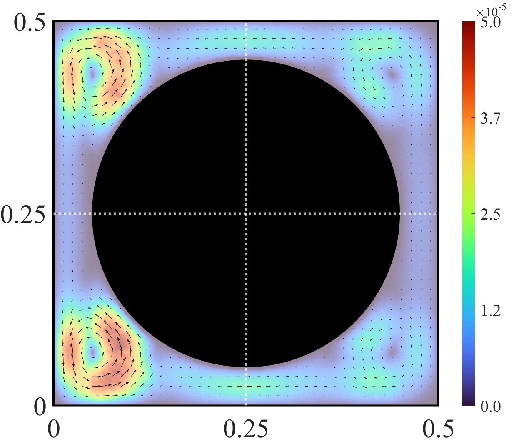
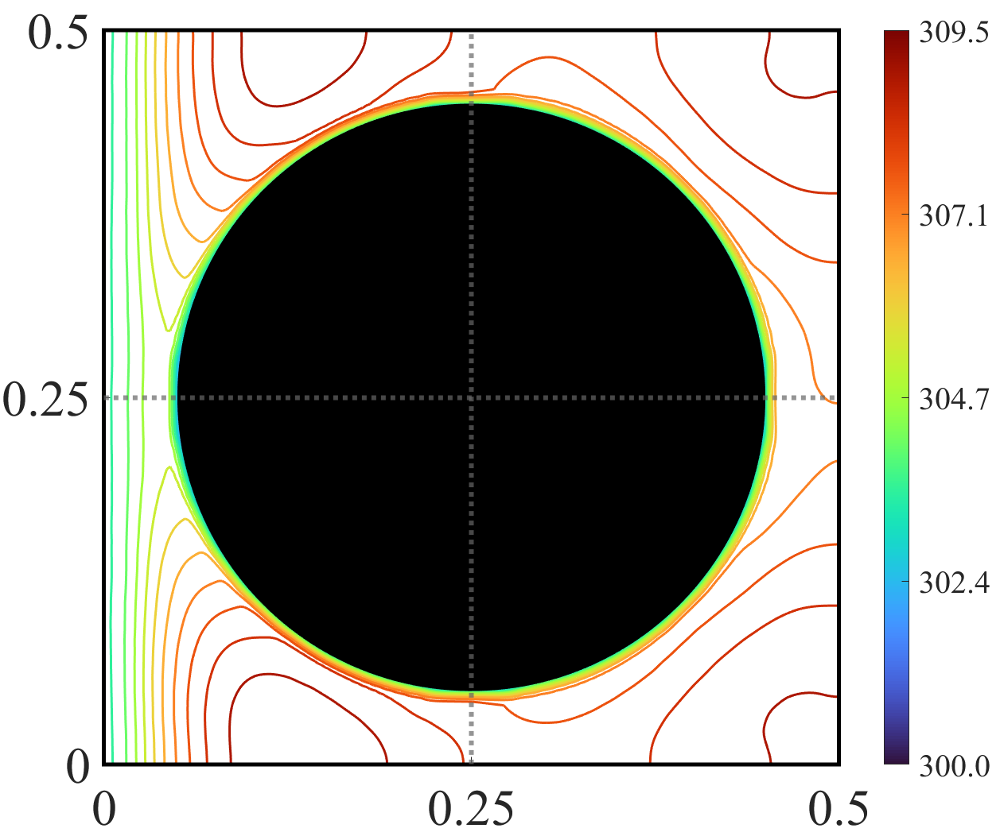

# Missara model solutions $$\betta=2$$

---

### 📊 Figure Gallery
| **d)** |**e)** |**f)** |
| :---: | :---: | :---: |
|  |  |  |
| **Radiation absorption field** | **Velocity field** | **Temperature field** |

---

### 📂 File Repository

| Filename | Description | Format |
| :--- | :--- | :--- |
| [A1_E_0.5.png](./A1__E_0.5.png) / [.fig](./A1_E_0.5.png) | Radiation absorption field. | Image / MATLAB |
|[A1_Vel_0.5.png](./A1_Vel_0.5.png) / [.fig](./A1_Vel_0.5.png) | Velocity field. | Image / MATLAB |
|[A1_Tem_0.5.png](./A1_Tem_0.5.png)/ [.fig](./A1_Tem_0.5.png) | Temperature field | Image / MATLAB |

### 🔬 Technical Details
* **Source Files:** All `.fig` files are compatible with MATLAB R2020b and newer.
* **Resolution:** Images are exported at 300 DPI for high-quality publication standards.

---
*PhD Figures Repository - Stochastic Thesis*
