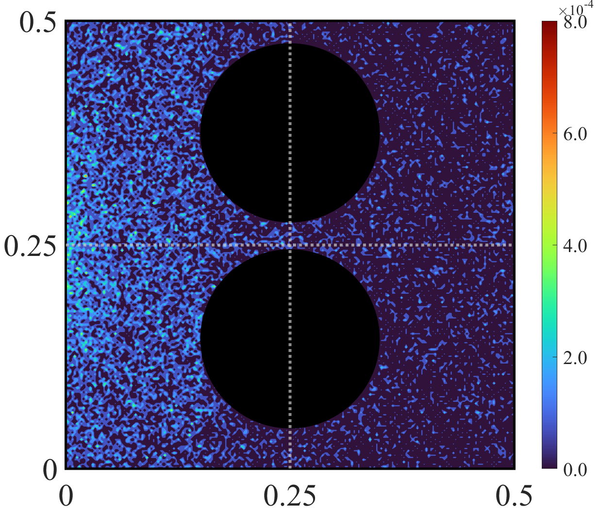
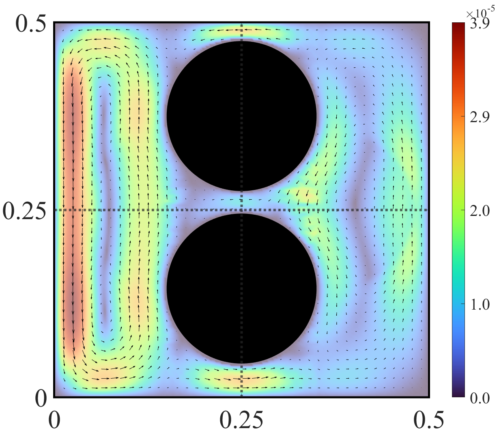
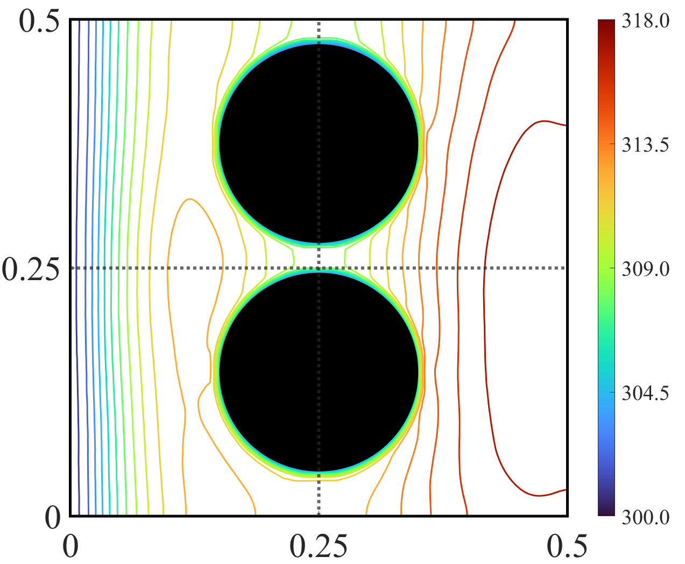

# Comparative Analysis: Figure Suite

This directory contains a set of three key visualizations and their corresponding source files for the stochastic analysis chapter.

---

### 📊 Figure Gallery

| d) | e)| f) |
| :---: | :---: | :---: |
|  |  |  |
| **Radiation absorption field** | **Velocity field** | **Temperature field** |

---

### 📂 File Repository

| Filename | Description | Format |
| :--- | :--- | :--- |
|[A2_E_0.5.png](./A2_E_0.5.png) / [.fig](./A2_E_0.5.png) | Radiation absorption field. | Image / MATLAB |
|[A2_Vel_0.5.png](./A2_Vel_0.5.png) / [.fig](./A2_Vel_0.5.png) | Velocity field. | Image / MATLAB |
|[A2_Tem_0.5.png](./A2_Tem_0.5.png)/ [.fig](./A2_Tem_0.5.png) | Temperature field | Image / MATLAB |

### 🔬 Technical Details
* **Source Files:** All `.fig` files are compatible with MATLAB R2020b and newer.
* **Resolution:** Images are exported at 300 DPI for high-quality publication standards.

---
*PhD Figures Repository - Stochastic Thesis*
